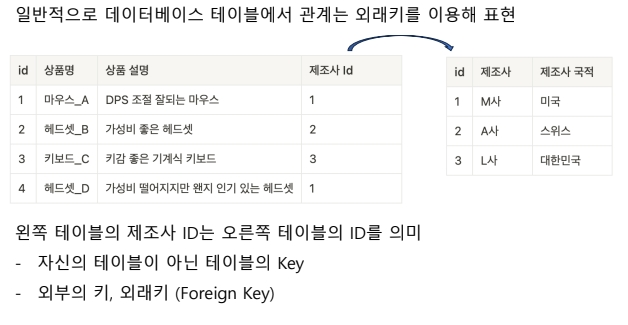

## Normalization 
- 데이터의 정규화

### 정규화, 정규형
 - 데이터베이스의 테이블에 담기는 데이터를 나누어 구조화하는 방법론
 - 학문적으로는 제6정규형까지 존재하나, 실무에서는 보통 제3정규형까지만 사용한다

  ### 제1정규형
  - 하나의 컬럼이 복수의 데이터를 가지고 있지 않아야 함
  - 복수의 값을 가지는 컬럼은 별도의 테이블을 만들어 제1정규형 테이블을 두 개로 나눈다

  ### 제2정규형
  - 기본키에 종속되지 않는 컬럼은 테이블을 분리한다
  - 명확한 의존성이 없는 컬럼을 분리

  ### 제3정규형
  - 다른 속성에 종속성을 갖는 컬럼을 분리한다

  ### RDB 관계
  1:1 One to One 관계
  - 한 테이블의 레코드 하나가 다른 테이블의 레코드 하나와 연관된 관계
  - 특정 데이터를 성능 또는 보안적 측면에서 나눌 때 사용

  N:1, Many to One 관계
  - 한 테이블의 레코드 0개 이상이 다른 테이블의 레코드 하나와 연관된 관계
  - 일반적인 데이터베이스의 가장 흔한 관계 (게시글 – 댓글, 가게 – 상품 등)

  M:N, Many to Many 관계
  - 한 테이블의 레코드 0개 이상이 다른 테이블의 레코드 0개 이상과 연관된 관계
  - 양쪽 테이블의 PK를 Foreign Key로 가진 Join Table, Associative Table 활용

  

### JOIN절
- 나누어진 테이블을 합칠 수 있다
- 외래키를 기본키로 가진 테이블과 조합
- 한쪽 테이블의 레코드에 다른 테이블의 기본키를 가르키는 외래키를 기준으로 연결 
  - 두 개의 테이블을 `JOIN`한다.

