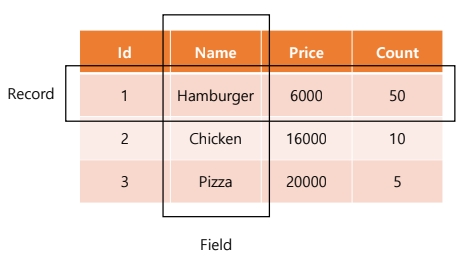
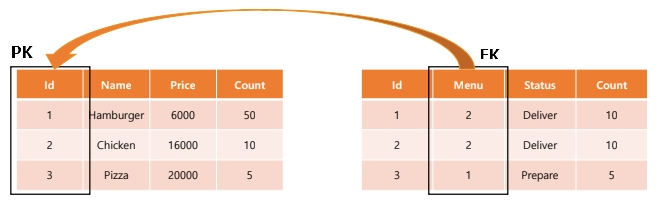

## 관계형 Database
- 데이터를 관계형식으로 표현한 데이터베이스
- 가장 많이 활용되고 있다

```
Id |   Name   | Price | Count |

1 | Hamburger |  6000 |   50  |

2 |  Chicken  | 16000 |   10  |

3 |   Pizza   | 20000 |   5   |
```


## 관계형 Database의 특징
- 데이터를 위처럼 테이블, 행, 열 등으로 나눠 구조화해 체계적으로 관리
- 테이블간의 관계를 설정
- 데이터 무결성 유지에 장점

### 스키마
- 관계형 데이터베이스가 가진 데이터의 구조를 표현한 것
- 기본적인 데이터베이스 자료의 구조와 표현 방법을 표시

### 테이블
- 필드와 레코드를 사용해 조직된 데이터 요소들의 집합  
  (필드: 속성 또는 컬럼, 레코드: 튜플 또는 행)

  
  필드에는 데이터 형식  
  레코으 하나는 테이블 하나의 데이터

  ### Primary Key
  기본 키, 각 레코드의 고유값 / = id (데이터 특정)

  ### Foreign Key  
  다른 테이블의 데이터로 어떠한 테이블의 데이터를 구성해야 할 경우,  
  Primary Key를 저장하여 사용
  


### RDBMS - 데이터베이스 매니지먼트 시스템
- `Relational Database Management System`
- 관계형 데이터베이스를 다루기 위한 프로그램의 일종
- 서버의 형태로 프로그램과 소통하여 Database를 조작한다
- 컴퓨터에 저장된 Database를 관리할 수 있게 해 주는 서버 관리 프로그램
- `ORACLE`, `SQLite`, `PostgreSQL`, `MariaDB`, `MySQL`등
>프로그램에 따라 사용법이 조금씩 다르다

