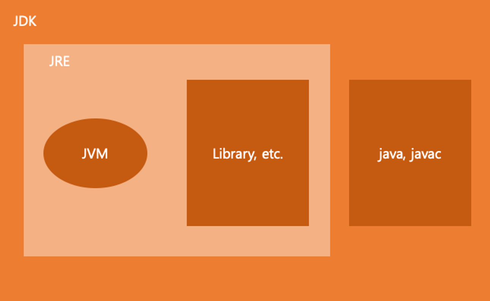

## Java란?
- 프로그래밍 언어
- High Level Language
- Java Bytecode로 컴파일되는 언어

### JVM
- Java Bytecode를 컴퓨터가 이해할 수 있는 형태로 변환하는 역할 수행

### JDK (Java Developement Kit)
- Java 코드를 Java Bytecode로 변환하는 역할 수행

### JRE (Java Runtime Enviornment)
- Java 라이브러리 실행 환경을 의미

