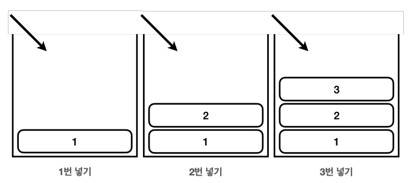
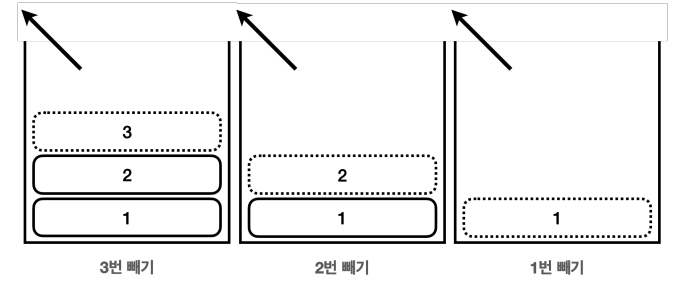
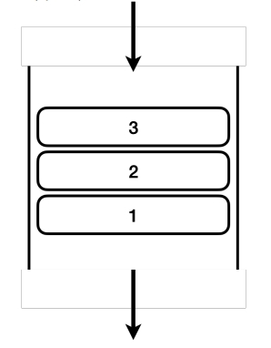

## Java의 데이터 저장
- Java의 데이터 저장 구조

  ### 메서드 영역(Method Area)
  - 프로그램을 실행하는데 필요한 공통 데이터 저장
  - 프로그램의 모든 영역에서 공유함.
  1. 클래스 정보: 클래스의 실행 코드, 필드, 메서드와 생성자 코드 등 모든 실행 코드
  2. `staic` 영역: 스태틱 변수를 보관  
  3. 런타임 상수 풀: 공통 리터럴 상수를 보관하여 관리. = 프로그램 최적화

  ### 스택 영역(Stack Area)
  - Java 실행시 생성되며 각 스택 프레임은 지역 변수, 중간 연산 결과, 메서드 호출 정보 등을 포함  
    = 실제 프로그램이 실행되는 영역
  1. 스택 프레임: 메서드를 호출할 때마다 생성되고 제거된다.

  ### 힙 영역(Heap Area)
  - 객체(인스턴스)와 배열이 생성되는 영역 / new

>인스턴스는 각각의 데이터가 저장되기 때문에 힙 영역에 메모리가 따로 할당되어 저장, 관리된다.  
>메서드는 하나의 코드로 데이터를 처리하기 때문에 메서드 영역에서 저장되어 호출된다. 


### Stack Memory 구조
- 후입 선출(LIFO, `Last In First Out`)



### Queue Memory 구조
- 선입 선출(FIFO, `First In First Out`)


>프로그램 실행과 메서드 호출에는 `Stack` 구조가 적합하다

```Java
public class JavaMemoryMain1 {
    public static void main(String[] args) {
        System.out.println("main start");
        method1(10);
        System.out.println("main end");
    }
    static void method1(int m1) {
        System.out.println("method1 start");
        int cal = m1 * 2;
        method2(cal);
        System.out.println("method1 end");
    }
    static void method2(int m2) {
        System.out.println("method2 start");
        System.out.println("method2 end");
    }
}
```
```
main start
method1 start
method2 start
method2 end
method1 end
main end
```
>`Stack` 메모리 구조와 같이 작동한다

### static (정적 변수)
- 특정 클래스에서 공용으로 함께 사용할 수 있는 변수
- `static`이 붙은 멤버 변수는 메서드 영역에서 관리한다  
  -> 인스턴트 영역에 생성하지 않는다

  ### 멤버 변수(필드)의 종류
  - 인스턴스 변수:  `static`이 붙지 않은 변수
    - `static`이 붙지 않은 멤버 변수는 인스턴스를 생성해야 사용할 수 있고, 인스턴스에 소속되어 있다.
    - 인스턴스 변수는 인스턴스를 만들 때마다 `새로` 만들어진다
  - 클래스 변수: `static`이 붙은 변수
    - 클래스 변수, 정적 변수, `static` 변수 등으로 부른다.
    - `static`이 붙은 멤버 변수는 인스턴스와 무관하게 클래스에 바로 접근해서 사용할 수 있고, 클래스에 소속되어 있다.
    - 인스턴스와는 다르게 여러곳에서 공유하는 목적으로 사용된다.

- 힙 영역에 생성되는 인스턴스 변수는 동적으로 생성되고, 제거된다
- 반면에 `static`인 정적 변수는 프로그램 시작 직전에 생성되고 종료시 제거된다.

  ### 클래스 `static` 메서드
  - 클래스 메서드에도 `static`을 붙여서 생성할 수 있다.
  - 객체 생성 없이 바로 불러와서 메서드 기능을 사용할 수 있다.