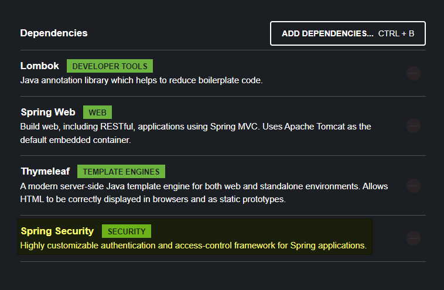
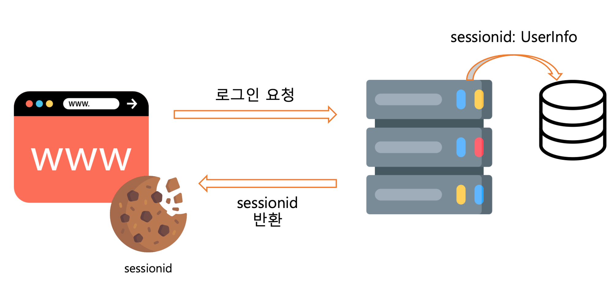

# Spring Security
- Spring Framework에서 이용할 수 있는 보안 패키지
- 인증과 권한 부여 과정 설계 가능
  - 인증(Authentication): 사용자가 본인을 증명하는 과정
  - 권한(Authorization): 사용자가 어떤 작업을 수행할 수 있는지 결정하는 과정  


  
>✏ Security 추가


  ## Form Login
  - 기본적으로 사용할 수 있는 인증 방식 = Login
  1. 사용가자 로그인 페이지로 이동
  2. 서버가 로그인 페이지로 사용자를 이동시킴
  3. 사용가는 로그인 페이지에서 Id, Password 전달
  3. 서버는 전달된 정보가 일치하는지 확인 후 인증
  >✏ 이후 서버는 쿠키를 이용하여 로그인한 사용자가 누구인지 기억하는 세션을 생성  
  >✏ `쿠키🍪`: 서버에서 사용자의 브라우저로 보내는 `작은 데이터`  
      -> 사용자의 로그인 정보를 쿠키에 담아 저장하여 유지하는 것을 `세션`이라고 부름
      

  ## Login 구현하기
  - `WebSecurityConfig`에서 `filterChain` 메소드 사용
  1. 경로 접근 권한 부여
  ```Java
  @Configuration
  public class WebSecurityConfig {
    @Bean
    // 메서드 결과를 Bean 객체로 관리해 주는 어노테이션
    public SecurityFilterChain securityFilterChain(
      HttpSecurity http
    ) throws Exception {
      http
          .csrf(AbstractHttpConfigurer::disable)
          .authorizeHttpRequests(auth -> auth
            // 어떤 경로에 대한 설정인지 먼저 적용
            .requestMatchers("/no-auth").permitAll()
            // "/no-auth"에는 모두가 접근 가능
           .requestMatchers("/users/my-profile").authenticated()
           // "/users/my-profile"에는 인증된 사용자만 접근 가능
    }
  ```
  >✏ `permitAll`: 모든 사용자 접근 허용  
  >✏ `authenticated`: 인증된 사용자만 접근 허용  
  >✏ `anonymous`: 익명 사용자만 접근 허용

  2. Login 설정
  ```Java
   // html form 요소를 이용하여 로그인을 할 수 있도록 설정
    .formLogin(formLogin -> formLogin
               // 어떤 경로로 요청을 보내면 해당 로그인 페이지가 나올지 설정
               .loginPage("/users/login") // 매핑 경로 입력
               // 아무 설정 없이 로그인이 성공한 뒤 이동할 페이지
               .defaultSuccessUrl("/users/my-profile")
               // 로그인이 실패시 이동할 페이지
               .failureUrl("/users/login?fail")
    );
  ```
  >✏ `.loginPage()` : 로그인 페이지의 URL을 설정  
  >✏`.defaultSuccessUrl()` : 로그인 성공시의 URL을 설정  
  >✏ `.failureUrl()` : 로그인 실패시의 URL을 설정 
  >✏ `.permitAll()` : 로그인 관련된 URL의 인증 요구사항을 해제

  3. LogOut 설정
  ```Java
    .logout(logout -> logout
          // 어떤 경로로 요청을 보내면 로그아웃이 되는지
          .logoutUrl("/users/logout")
          // 로그아웃 성공시 이동할 페이지
           .logoutSuccessUrl("/users/login")
    );
  ```
  >✏ `.logoutUrl`: 로그아웃을 처리하는 URL을 설정
  >✏ `.logoutSuccessUrl`: 로그아웃 성공 시 리다이렉트되는 URL을 설정

  - `UserDetailsManager`와 비밀번호 암호화(`PasswordEncoder`) 사용
  1. 사용자 정보 관리
  ```Java
    @Bean
    // 사용자 정보 관리 클래스
    public UserDetailsManager userDetailsManager(
            PasswordEncoder passwordEncoder
    ) {
        // 사용자 1 생성
        UserDetails user1 = User.withUsername("user1")
                .password(passwordEncoder.encode("password1"))
                .build();
        // Spring Security에서 기본으로 제공하는 메모리 기반 사용자 클래스 + 사용자 1
        return new InMemoryUserDetailsManager(user1);
    }
  ```
  2. 비밀번호 암호화
  ```Java
    @Bean
    // 비밀번호 암호화 클래스
    public PasswordEncoder passwordEncoder() {
        return new BCryptPasswordEncoder();
    }
  ```
  